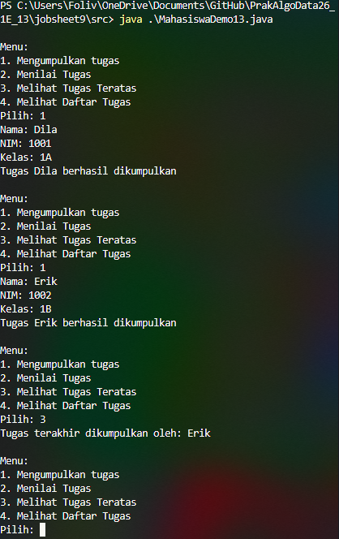
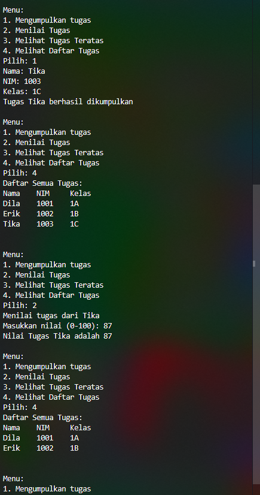
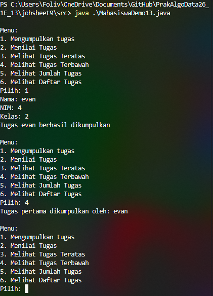
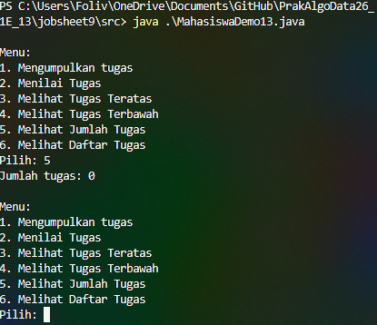
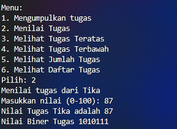
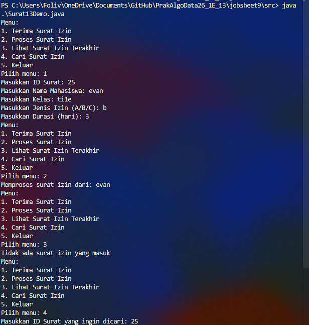

# Laporan Praktikum Algoritma dan Struktur Data - Jobsheet 9 - Stack

<h4>Nama : Mohammad Daanii Althaaf Reivan Fadhlillah<h4>
<h4>NIM : 254107020123<h4>
<h4>Kelas : TI-1E<h4>

## 2.1 Percobaan 1: Mahasiswa Mengumpulkan Tugas

### 2.1.1 Verifikasi Hasil Percobaan



### 2.1.2 Pertanyaan

1. Pada kode print, yang diprint adalah yang paling baru, bukan selalu dari indeks 0. Jadi method print pada StackTugasMahasiswa13 harus disesuaikan agar mencetak dari top ke bottom (LIFO).
```java
public void print(){
    for(int i = top; i >= 0; i--){
        System.out.println( stack[i].nama + "\t" + stack[i].nim + "\t" + stack[i].kelas );
    }
    System.out.println();
}
```

2. Berapa kapasitas maksimal stack pada program tersebut?
   Maksimal 5, dikarenakan instansiasi pada Main: ```StackTugasMahasiswa13 stack = new StackTugasMahasiswa13(5);```

3. Apa kegunaan dari method isFull?
   Untuk mencegah stackoverflow (penambahan data saat memori/array sudah penuh). Jika tidak dicek, program akan mengalami error ```ArrayIndexOutOfBoundsException```.

4. Modifikasi program dengan menambahkan method peekBottom() untuk melihat data paling bawah!
   Menambah method di class `StackTugasMahasiswa13`:
```java
public Mahasiswa13 peekBottom() {
    if (!isEmpty()) {
        return stack[0];
    } else {
        System.out.println("Stack kosong!");
        return null;
    }
}
``` 
   Dan menambahkan menu pada `MahasiswaDemo13`:
```java
case 4:
    Mahasiswa13 lihatBawah = stack.peekBottom();
    if(lihatBawah != null){
        System.out.println("Tugas pertama dikumpulkan oleh: " + lihatBawah.nama);
    }
    break;
```
   



## 2.2 Percobaan 2: Konversi Nilai Tugas ke Biner

### 2.2.1 Verifikasi Hasil Percobaan


### 2.2.2 Pertanyaan
1. Jelaskan alur kerja dari method konversiDesimalKeBiner!
   **Jawab:** Method ini menerima parameter integer `nilai`. Di dalamnya, terdapat perulangan `while (nilai > 0)` yang melakukan operasi modulo 2 (`nilai % 2`) untuk mendapatkan sisa bagi (0 atau 1), lalu sisa tersebut di-`push` ke dalam `StackKonversi13`. Setelah itu, `nilai` dibagi 2. Proses ini berlanjut sampai `nilai` habis (0). Karena menggunakan Stack (LIFO), maka saat data di-`pop` dan disusun menjadi string, urutan angka biner yang dihasilkan sudah benar (dari sisa bagi terakhir ke pertama).

2. Pada method konversiDesimalKeBiner, ubah kondisi perulangan menjadi while (nilai != 0), bagaimana hasilnya? Jelaskan alasannya!
   **Jawab:** Untuk input bilangan positif (seperti nilai 0-100), hasilnya akan **sama saja**. Hal ini dikarenakan pada bilangan positif, kondisi `nilai > 0` dan `nilai != 0` akan berhenti di titik yang sama yaitu saat nilai mencapai 0. Namun, jika inputnya adalah bilangan negatif, `nilai != 0` akan menyebabkan perulangan terus berjalan (infinite loop) atau menghasilkan perilaku berbeda tergantung cara Java menangani pembagian negatif, sedangkan `nilai > 0` tidak akan menjalankan perulangan sama sekali.

## 2.4 Latihan Praktikum

### 2.4.1 Verifikasi Hasil Percobaan


### 2.4.2 Hasil Percobaan
1. **Class Surat13:** Digunakan sebagai struktur data untuk menyimpan informasi surat izin yang terdiri dari `idSurat`, `namaMahasiswa`, `kelas`, `jenisIzin` (S/I), dan `durasi` (hari).
2. **Class StackSurat13:** Implementasi struktur data Stack untuk menyimpan objek `Surat13`. Memiliki method:
    - `push(Surat13 surat)`: Menambahkan surat ke dalam tumpukan.
    - `pop()`: Mengeluarkan surat teratas dari tumpukan (LIFO).
    - `peek()`: Melihat surat yang berada di posisi teratas.
    - `isFull()` & `isEmpty()`: Mengecek status kapasitas stack.
3. **Class Surat13Demo:** Implementasi menu interaktif untuk mengelola operasional surat izin, termasuk fitur tambahan untuk mencari surat izin dalam stack berdasarkan nama mahasiswa. Melalui program ini, admin dapat memproses surat izin sesuai urutan masuk (terakhir masuk diproses lebih dulu).