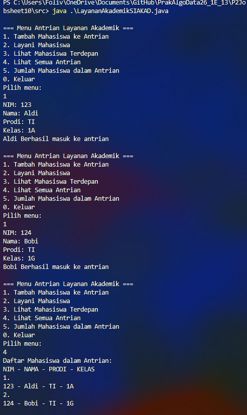
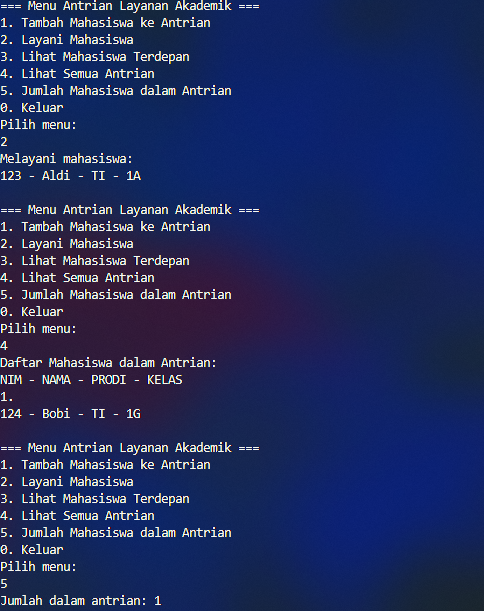
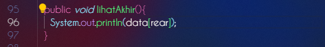
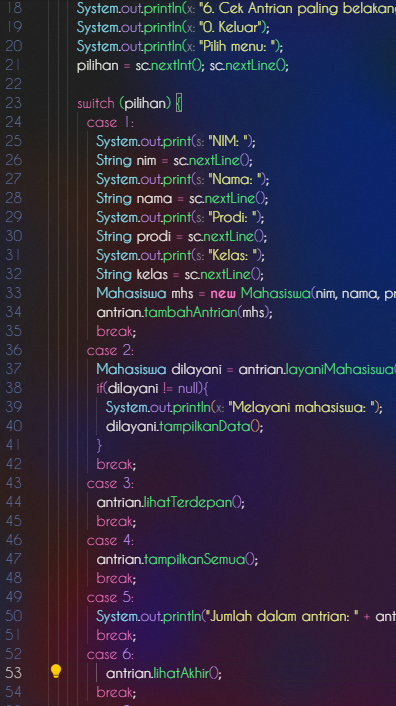
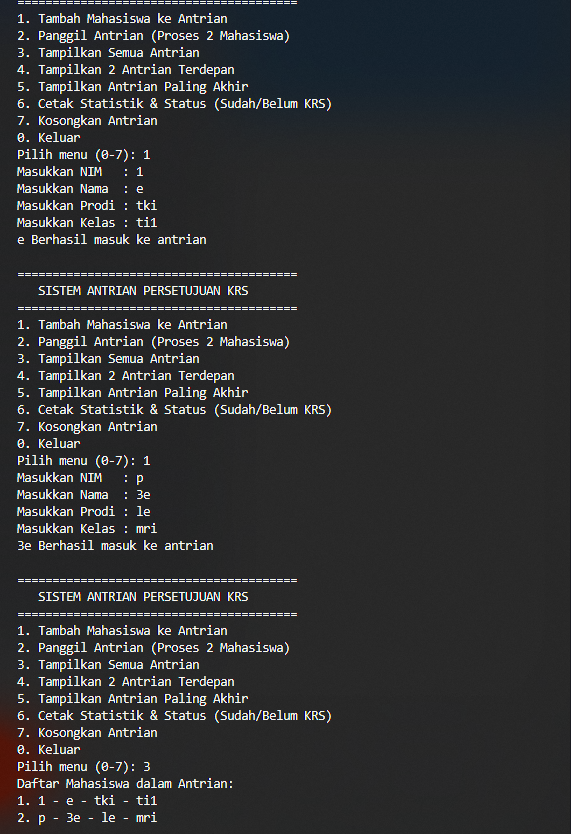
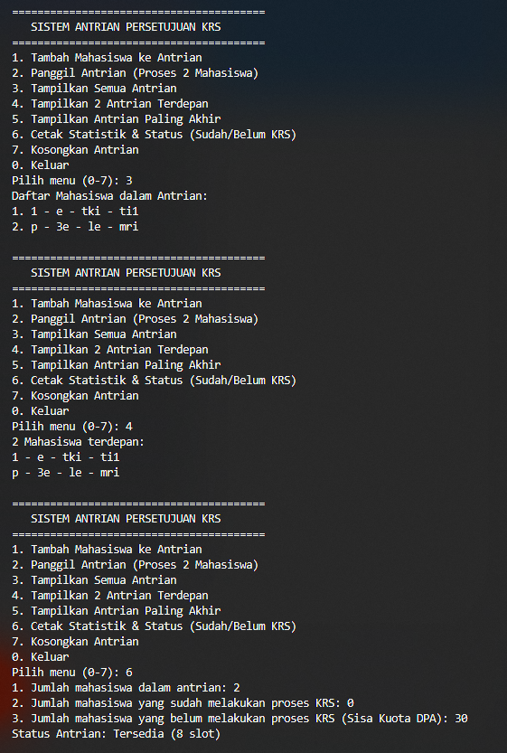
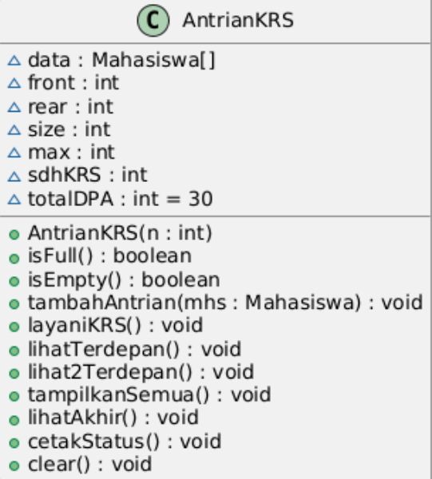

# Laporan Praktikum 10 - Queue

### 2.2.2 Verifikasi Hasil Percobaan
Hasil verifikasi program Antrian Layanan Akademik:

### 2.2.3 Pertanyaan
Lakukan modifikasi program dengan menambahkan method baru bernama `LihatAkhir` pada class `AntrianLayanan`.

#### Penjelasan:
Method `lihatAkhir()` ditambahkan untuk menampilkan data mahasiswa yang berada pada posisi paling belakang (`rear`) dalam antrian.

Hasil modifikasi dan verifikasi `lihatAkhir()`:

## 2.3 Tugas: Antrian KRS Mahasiswa

