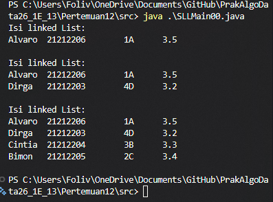
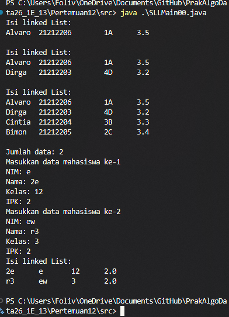
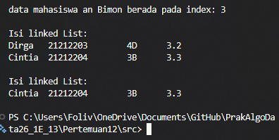
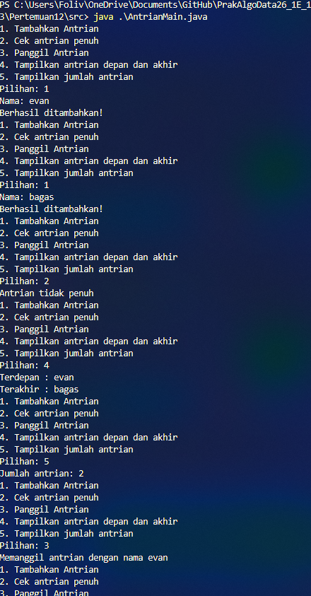

## 2.1.1

## 2.1.2
1. Kode program di baris pertama kosong karena fungsi TampilInformasi pada class Mahasiswa00 belum terisi, dan berhasil menampilkan linkedlist setelah ditulis kode untuk menampilkan output.
2. Untuk menyimpan sementara kloning dari linkedlist yang akan dilakukan proses baik untuk mencari value tertentu atau indeks tertentu tanpa mempengaruhi data linkedlist asli.
3. 

## 2.2.2

## 2.2.3
1. Agar perulangan berhenti pada saat yang diperlukan dan tidak perlu mencapai kondisi temp==null.
2. Sebenarnya kode yang diinstruksikan ada kesalahan di kondisinya yang dimana menunjuk ke node sekarang, bukan node selanjutnya. Tetapi ini untuk merubah jika node selanjutnya merupakan data yang sesuai, maka referensi ke node selanjutnya dirubah ke node setelah node selanjutnya. Dan jika node yang dirubah referensi next nya adalah null, maka node ini akan menjadi tail dari SLL nya.

## 3. Tugas
1. Hasil eksekusi file tugas:
