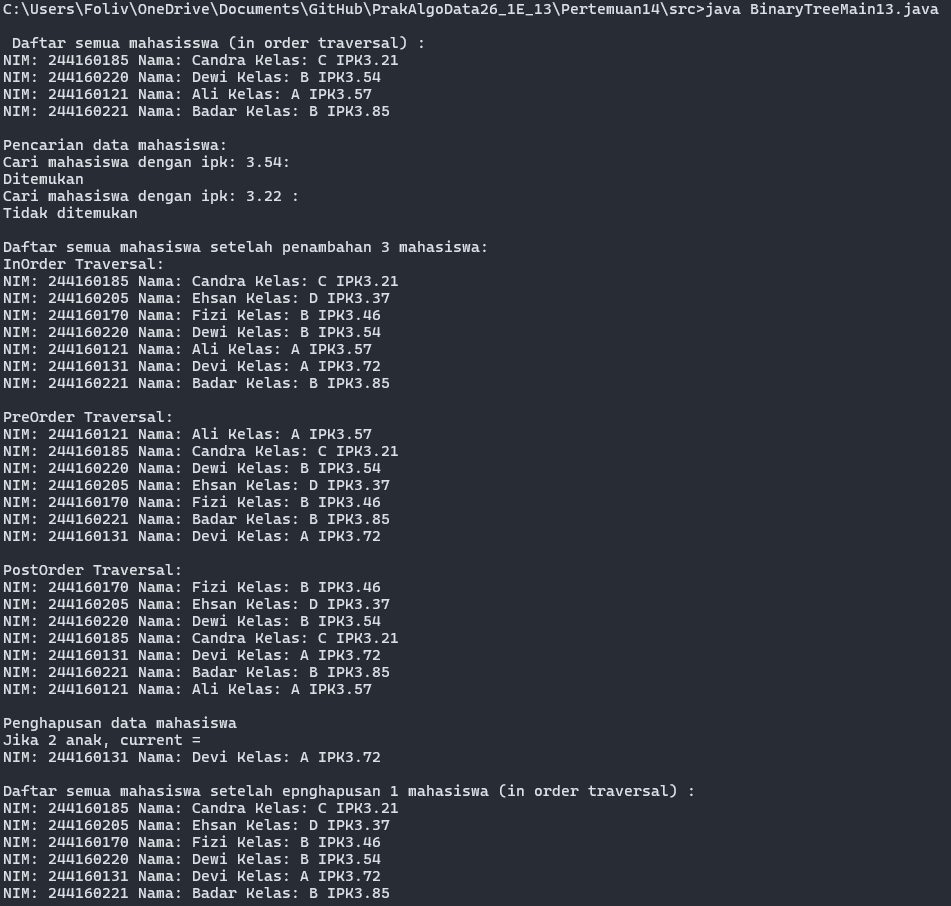
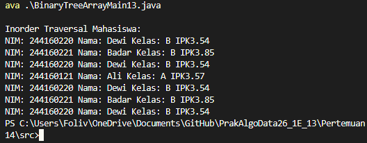

# Laporan Praktikum Algoritma dan Struktur Data Jobsheet 14

<h4>Nama : Mohammad Daanii Althaaf Reivan Fadhlillah<h4>
<h4>NIM : 254107020123<h4>
<h4>Kelas : TI-1E<h4>

## 14.2.1 Output Hasil

## 14.2.2 Pertanyaan Percobaan
1. **Mengapa dalam binary search tree proses pencarian data bisa lebih efektif dilakukan dibanding binary tree biasa?**
   Karena pada BST, data sudah terurut. Node dengan nilai lebih kecil berada di kiri, dan yang lebih besar di kanan. Sehingga pencarian tidak perlu mengecek semua node, melainkan membelah pencarian menjadi setengah di setiap langkahnya (kompleksitas waktu O(log n)).
2. **Untuk apakah di class Node, kegunaan dari atribut left dan right?**
   Atribut `left` untuk menyimpan referensi atau pointer ke node anak sebelah kiri (yang nilainya lebih kecil), dan `right` untuk referensi ke node anak sebelah kanan (yang nilainya lebih besar).
3. **a. Untuk apakah kegunaan dari atribut root di dalam class BinaryTree?**
   Atribut `root` digunakan sebagai penunjuk referensi ke node akar (node paling atas/pertama) dari sebuah tree.
   **b. Ketika objek tree pertama kali dibuat, apakah nilai dari root?**
   Nilai root adalah `null` karena tree pada saat itu masih kosong.
4. **Ketika tree masih kosong, dan akan ditambahkan sebuah node baru, proses apa yang akan terjadi?**
   Node baru tersebut akan diinstansiasi dan nilainya langsung di-assign sebagai `root` dari tree tersebut.
5. **Perhatikan method add(), di dalamnya terdapat baris program seperti di bawah ini. Jelaskan secara detil untuk apa baris program tersebut?**
   Baris program tersebut menelusuri tree untuk menemukan posisi yang tepat bagi node baru. Variabel `parent = current` menyimpan node saat ini sebelum menelusuri ke bawahnya (anak). Jika IPK mahasiswa baru lebih kecil dari IPK node current, maka penelusuran berlanjut ke anak kiri (`current = current.left`). Jika posisi anak kiri ternyata kosong (`current == null`), maka node baru tersebut disambungkan sebagai anak kiri dari `parent` (`parent.left = newNode`), lalu perulangan dihentikan (`return`).
6. **Jelaskan langkah-langkah pada method delete() saat menghapus sebuah node yang memiliki dua anak. Bagaimana method getSuccessor() membantu dalam proses ini?**
   Langkah-langkahnya: method akan mencari node pengganti (successor) menggunakan `getSuccessor()`. Kemudian pointer anak dari node parent (atau root) akan diubah untuk menunjuk ke successor tersebut. Terakhir, sub-tree bagian kiri dari node yang dihapus akan dipasangkan menjadi anak kiri dari successor. `getSuccessor()` membantu proses ini dengan cara menemukan node dengan nilai terkecil di sub-tree sebelah kanan dari node yang dihapus, yang mana merupakan node paling ideal untuk naik ke atas dan mempertahankan struktur BST tetap terurut.

## 14.3.2 Pertanyaan Percobaan
1. **Apakah kegunaan dari atribut data dan idxLast yang ada di class BinaryTreeArray?**
   Atribut `data` (atau `dataMahasiswa`) digunakan untuk menampung elemen-elemen dari tree secara berurutan dalam bentuk struktur array. `idxLast` berguna untuk menyimpan informasi indeks dari elemen terakhir yang valid terisi di dalam array tersebut.
2. **Apakah kegunaan dari method populateData()?**
   Method ini digunakan untuk menginisialisasi atribut `dataMahasiswa` dan `idxLast` dengan array sumber dan batas indeks yang dilempar dari parameter, sehingga tree array akan langsung memiliki sekumpulan data awal.
3. **Apakah kegunaan dari method traverseInOrder()?**
   Untuk mengunjungi dan mencetak isi node-node di dalam tree secara in-order (Left-Root-Right). Karena ini adalah BST, traversal in-order akan menghasilkan data yang tampil secara berurutan (ascending).
4. **Jika suatu node binary tree disimpan dalam array indeks 2, maka di indeks berapakah posisi left child dan right child masing-masing?**
   - Posisi left child berada di indeks: `2 * 2 + 1 = 5`.
   - Posisi right child berada di indeks: `2 * 2 + 2 = 6`.
5. **Apa kegunaan statement int idxLast = 6 pada praktikum 2 percobaan nomor 4?**
   Statement tersebut mendefinisikan batas indeks terakhir yang berisi node yang valid di dalam array tree. Ini memberi tahu program bahwa data di dalam array hanya relevan dibaca sampai indeks ke-6 saja, sisanya bisa diabaikan atau dianggap null.
6. **Mengapa indeks 2*idxStart+1 dan 2*idxStart+2 digunakan dalam pemanggilan rekursif, dan apa kaitannya dengan struktur pohon biner yang disusun dalam array?**
   Rumus tersebut adalah standard matematika untuk merepresentasikan letak node-node tree ke dalam struktur data sekuensial (array). Indeks `2*i + 1` digunakan untuk melompat ke anak sebelah kiri dari node `i`, sedangkan `2*i + 2` digunakan untuk melompat ke anak sebelah kanannya. Ini sangat penting karena array tidak memiliki object pointer left/right untuk ditelusuri seperti Linked List BST.

## 14.3.1 Output Hasil

## 14.4 Tugas Praktikum
Pada bagian ini, dilakukan beberapa penambahan method ke dalam `BinaryTree13` dan `BinaryTreeArray13` sebagai berikut:
1. Menambahkan method rekursif `addRekursif()` pada BinaryTree13.
2. Menambahkan pencarian IPK menggunakan `cariMinIPK()` dan `cariMaxIPK()`.
3. Menambahkan method filter untuk menampilkan Mahasiswa yang memiliki IPK di atas batas tertentu, yaitu `tampilMahasiswaIPKdiAtas(double ipkBatas)`.
4. Memodifikasi class `BinaryTreeArray13` untuk dapat menambahkan node tunggal via method `add(Mahasiswa13 data)` serta traversal tambahan `traversePreOrder(int idxStart)`.

