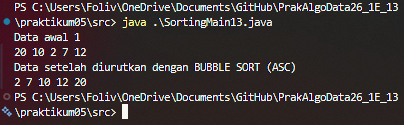
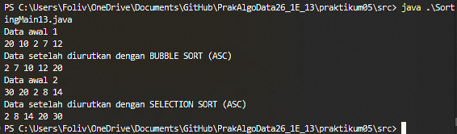
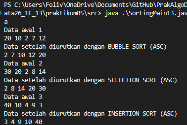

# Laporan Praktikum Algoritma dan Struktur Data
## Jobsheet 5: SORTING (BUBBLE, SELECTION, DAN INSERTION SORT)

**Nama  :** Mohammad Daanii Althaaf Reivan Fadhlillah  
**NIM   :** 254107020123  
**Kelas :** TI-1E  

---

### 5.2 Praktikum 1 - Mengimplementasikan Sorting menggunakan object

#### 5.2.2 Verifikasi Hasil Percobaan (Bubble Sort)
Hasil pengurutan menggunakan Bubble Sort secara *ascending*:


#### 5.2.3 Verifikasi Hasil Percobaan (Selection Sort)
Hasil pengurutan menggunakan Selection Sort secara *ascending*:


#### 5.2.4 Verifikasi Hasil Percobaan (Insertion Sort)
Hasil pengurutan menggunakan Insertion Sort secara *ascending*:


#### 5.2.5 Pertanyaan!
1. **Jelaskan fungsi kode program berikut:**
   ```java
   if (data[j-1]>data[j]) {
       temp = data[j];
       data[j] = data[j-1];
       data[j-1] = temp;
   }
   ```
   **Jawab:** Kode tersebut berfungsi untuk menukarkan posisi dua elemen array (*swapping*) jika elemen sebelumnya (`data[j-1]`) memiliki nilai yang lebih besar daripada elemen saat ini (`data[j]`). Variabel `temp` digunakan untuk menyimpan sementara nilai dari salah satu elemen agar tidak hilang saat proses penukaran nilai berlangsung.

2. **Tunjukkan kode program yang merupakan algoritma pencarian nilai minimum pada selection sort!**
   **Jawab:**
   Kode untuk mencari nilai minimum pada algoritma Selection Sort adalah sebagai berikut:
   ```java
   int min = i;
   for (int j = i+1; j < jumData; j++) {
       if (data[j]<data[min]) {
           min = j;
       }
   }
   ```

3. **Pada Insertion sort, jelaskan maksud dari kondisi pada perulangan `while (j>=0 && data[j]>temp)`**
   **Jawab:**
   *   `j >= 0`: Kondisi ini memastikan bahwa indeks `j` tidak keluar dari batas bawah array (indeks minimal adalah 0).
   *   `data[j] > temp`: Kondisi ini memeriksa apakah elemen di posisi `j` lebih besar daripada nilai `temp` (elemen yang sedang diproses). Jika benar, maka elemen tersebut perlu digeser ke kanan.

4. **Pada Insertion sort, apakah tujuan dari perintah `data[j+1] = data[j];`?**
   **Jawab:** Perintah tersebut bertujuan untuk menggeser elemen yang nilainya lebih besar dari `temp` ke arah kanan satu posisi. Hal ini dilakukan untuk memberikan ruang kosong bagi nilai `temp` agar dapat disisipkan pada posisi yang benar setelah semua elemen yang lebih besar telah digeser.
