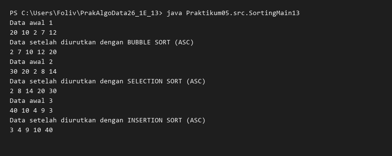
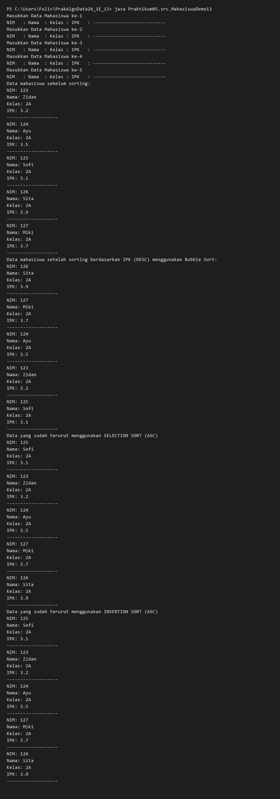
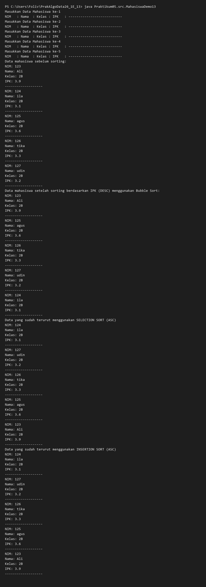
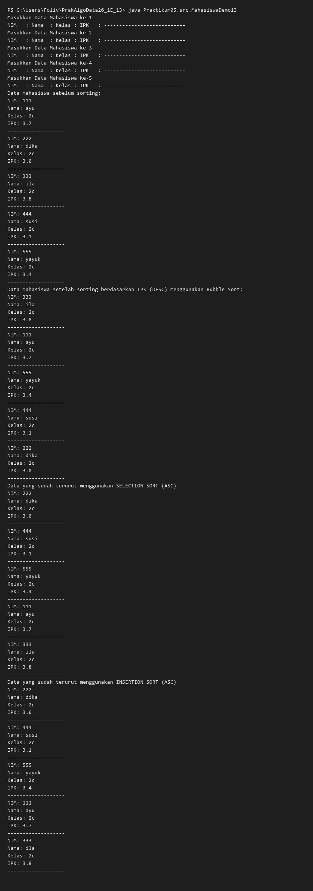
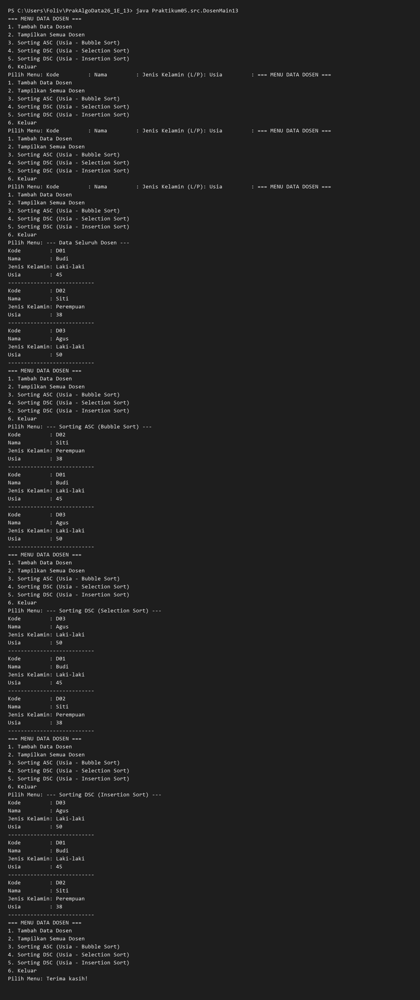

# Laporan Praktikum Algoritma dan Struktur Data Jobsheet 5

<h4>Nama : Mohammad Daanii Althaaf Reivan Fadhlillah<h4>
<h4>NIM : 254107020123<h4>
<h4>Kelas : TI-1E<h4>

## 5.2.2 Verifikasi Hasil Percobaan (Bubble, Selection, Insertion Sort)


## 5.2.3 Pertanyaan
1. **Jelaskan fungsi kode program berikut:**
   ```java
   if (data[j-1]>data[j]) {
       temp = data[j];
       data[j] = data[j-1];
       data[j-1] = temp;
   }
   ```
   **Jawab:** Kode tersebut berfungsi untuk menukarkan posisi dua elemen array (**swapping**) jika elemen sebelumnya (`data[j-1]`) memiliki nilai yang lebih besar daripada elemen saat ini (`data[j]`). Variabel `temp` digunakan untuk menyimpan sementara nilai dari salah satu elemen agar tidak hilang saat proses penukaran nilai berlangsung.

2. **Tunjukkan kode program yang merupakan algoritma pencarian nilai minimum pada selection sort!**
   **Jawab:**
   Kode untuk mencari nilai minimum pada algoritma Selection Sort adalah sebagai berikut:
   ```java
   int min = i;
   for (int j = i+1; j < jumData; j++) {
       if (data[j]<data[min]) {
           min = j;
       }
   }
   ```

3. **Pada Insertion sort, jelaskan maksud dari kondisi pada perulangan `while (j>=0 && data[j]>temp)`**
   **Jawab:**
   - `j >= 0`: Kondisi ini memastikan bahwa indeks `j` tidak keluar dari batas bawah array (indeks minimal adalah 0).
   - `data[j] > temp`: Kondisi ini memeriksa apakah elemen di posisi `j` lebih besar daripada nilai `temp` (**elemen yang sedang diproses**). Jika benar, maka elemen tersebut perlu digeser ke kanan.

4. **Pada Insertion sort, apakah tujuan dari perintah `data[j+1] = data[j];`?**
   **Jawab:** Perintah tersebut bertujuan untuk menggeser elemen yang nilainya lebih besar dari `temp` ke arah kanan satu posisi. Hal ini dilakukan untuk memberikan ruang kosong bagi nilai `temp` agar dapat disisipkan pada posisi yang benar setelah semua elemen yang lebih besar telah digeser.

## 5.3.3 Verifikasi Hasil Percobaan (Bubble Sort IPK)


## 5.3.4 Pertanyaan
1. **Perhatikan perulangan di dalam bubbleSort():**
   - a. **Mengapa syarat dari perulangan i adalah `i<listMhs.length-1`?**
   **Jawab:** Karena pada setiap iterasi `i`, elemen yang nilainya paling kecil (jika descending) akan "menguap" ke posisi yang paling belakang. Setelah `n-1` iterasi, elemen terakhir otomatis akan berada pada posisi yang benar.
   - b. **Mengapa syarat dari perulangan j adalah `j<listMhs.length-i`?**
   **Jawab:** Karena setelah setiap tahap `i`, satu elemen di ujung array sudah pasti berada pada posisinya yang benar, sehingga pada iterasi berikutnya elemen tersebut tidak perlu dibandingkan lagi.
   - c. **Jika banyak data 50, maka berapakali perulangan i akan berlangsung? Dan ada berapa Tahap bubble sort yang ditempuh?**
   **Jawab:** Perulangan `i` akan berlangsung sebanyak 49 kali, dan tahap yang ditempuh juga sebanyak 49 tahap.

2. **Modifikasi program diatas dimana data mahasiswa bersifat dinamis (input dari keyboard)!**
   **Jawab:** Implementasi telah dilakukan pada class `MahasiswaDemo13.java` dengan menggunakan class `Scanner` untuk input data dari pengguna.

## 5.3.6 Verifikasi Hasil Percobaan (Selection Sort IPK)


## 5.3.7 Pertanyaan
**Untuk apakah proses pencarian `idxMin` pada Selection Sort?**
**Jawab:** Proses tersebut bertujuan untuk mencari elemen dengan nilai terkecil pada bagian array yang belum terurut. Setelah ditemukan, elemen terkecil tersebut akan ditukarkan posisinya dengan elemen pertama dari bagian array yang belum terurut tersebut.

## 5.4.2 Verifikasi Hasil Percobaan (Insertion Sort IPK)


## 5.4.3 Pertanyaan
**Ubahlah fungsi pada InsertionSort sehingga fungsi ini dapat melaksanakan proses sorting dengan cara descending.**
**Jawab:**
Modifikasi dilakukan pada kondisi `while` dengan mengubah operator perbandingan dari `>` menjadi `<`.
```java
void insertionSortDescending() {
    for (int i = 1; i < listMhs.length; i++) {
        Mahasiswa13 temp = listMhs[i];
        int j = i;
        while (j > 0 && listMhs[j - 1].ipk < temp.ipk) {
            listMhs[j] = listMhs[j - 1];
            j--;
        }
        listMhs[j] = temp;
    }
}
```

## 5.5 Latihan Praktikum

- Program mengelola data dosen dengan fitur sorting berdasarkan usia menggunakan tiga algoritma berbeda.
- **Bubble Sort** digunakan untuk pengurutan secara *ascending* (termuda ke tertua).
- **Selection Sort** dan **Insertion Sort** digunakan untuk pengurutan secara *descending* (tertua ke termuda).
