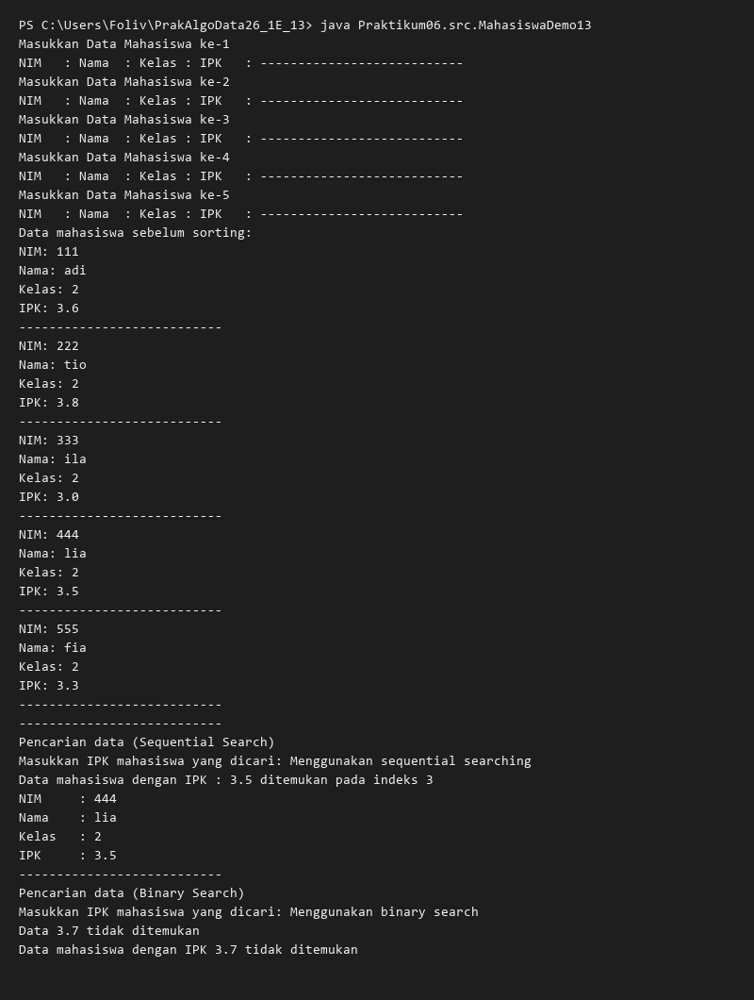
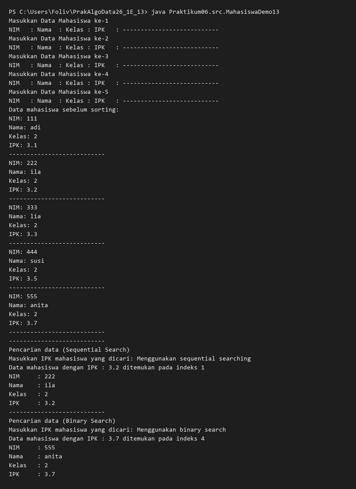

# Laporan Praktikum Algoritma dan Struktur Data Jobsheet 6

<h4>Nama : Mohammad Daanii Althaaf Reivan Fadhlillah<h4>
<h4>NIM : 254107020123<h4>
<h4>Kelas : TI-1E<h4>

## 6.2.2 Verifikasi Hasil Percobaan (Sequential Search)


## 6.2.3 Pertanyaan
1. **Jelaskan perbedaan method tampilDataSearch dan tampilPosisi pada class MahasiswaBerprestasi!**
   **Jawab:** `tampilPosisi` berfungsi untuk memberikan informasi apakah data ditemukan dan di indeks keberapakah data tersebut berada. Sedangkan `tampilDataSearch` berfungsi untuk menampilkan detail seluruh atribut mahasiswa (NIM, Nama, Kelas, IPK) pada indeks yang telah ditemukan tersebut.

2. **Jelaskan fungsi break pada kode program di bawah ini!**
   ```java
   if (listMhs[j].ipk == cari) {
       posisi = j;
       break;
   }
   ```
   **Jawab:** Perintah **break** berfungsi untuk menghentikan iterasi `for` secara paksa segera setelah data yang dicari ditemukan. Hal ini meningkatkan efisiensi karena program tidak perlu lagi mengecek elemen sisa jika data sudah ditemukan.

3. **Apa fungsi variabel pos atau indeks hasil pencarian dalam program sequential search?**
   **Jawab:** Variabel tersebut berfungsi untuk menyimpan posisi (indeks) elemen array yang nilainya cocok dengan kriteria pencarian. Jika setelah perulangan selesai nilainya tetap -1, itu menandakan data tidak ditemukan (**not found**).

4. **Jika terdapat lebih dari satu data dengan nilai yang sama, hasil pencarian sequential search yang dibuat di atas akan menampilkan data ke berapa? Jelaskan.**
   **Jawab:** Akan menampilkan data yang ditemukan pertama kali (**indeks terkecil**). Hal ini dikarenakan adanya perintah **break** yang langsung menghentikan proses pencarian saat kecocokan pertama ditemukan.

5. **Berkaitan dengan pertanyaan nomor 2 di atas, apa yang terjadi jika perintah break dihapus dari kode di atas?**
   **Jawab:** Program akan terus melakukan iterasi sampai akhir array meskipun data sudah ditemukan. Jika terdapat data ganda, maka variabel `posisi` akan menyimpan indeks dari data terakhir yang ditemukan karena nilainya akan terus tertimpa (**overwrite**) selama loop berjalan.

## 6.3.2 Verifikasi Hasil Percobaan (Binary Search)


## 6.3.3 Pertanyaan
1. **Tunjukkan pada kode program yang mana proses divide dijalankan!**
   **Jawab:** Proses **divide** terjadi pada baris: `mid = (left + right) / 2;` di mana rentang pencarian dibagi menjadi dua bagian.

2. **Tunjukkan pada kode program yang mana proses conquer dijalankan!**
   **Jawab:** Proses **conquer** terjadi saat method memanggil dirinya sendiri secara **rekursif** pada sub-bagian array yang telah ditentukan:
   `return findBinarySearch(cari, left, mid - 1);` atau `return findBinarySearch(cari, mid + 1, right);`

3. **Apa fungsi left, right, dan mid?**
   **Jawab:** 
   * **left**: Menentukan batas awal (**indeks terkecil**) dari rentang pencarian yang aktif.
   * **right**: Menentukan batas akhir (**indeks terbesar**) dari rentang pencarian yang aktif.
   * **mid**: Merupakan indeks titik tengah yang digunakan sebagai pembanding utama dengan data yang dicari.

4. **Jika data IPK yang dimasukkan tidak urut. Apakah program masih dapat berjalan? Mengapa demikian?**
   **Jawab:** Program tetap dapat berjalan, namun logika **Binary Search** tidak akan bekerja dengan benar. Data kemungkinan besar tidak akan ditemukan meskipun sebenarnya ada, karena algoritma ini mengasumsikan data sudah terbagi secara teratur.

5. **Jika IPK yang dimasukkan dari IPK terbesar ke terkecil dan elemen yang dicari adalah yang terkecil. Bagaimana hasil dari binary search?**
   **Jawab:** Hasilnya akan tidak sesuai (**tidak ditemukan**) karena arah pencariannya salah. Binary Search standar mencari ke kanan untuk nilai yang lebih besar, sementara pada data **descending**, nilai yang lebih besar ada di sebelah kiri.

6. **Jelaskan bagaimana binary search menentukan bahwa data yang dicari tidak ditemukan di dalam array.**
   **Jawab:** Binary search menentukan data tidak ditemukan ketika kondisi `right >= left` sudah tidak terpenuhi lagi (artinya `left > right`). Ini menunjukkan bahwa seluruh rentang pencarian telah dipersempit hingga habis tanpa menemukan kecocokan.

7. **Modifikasi program di atas yang mana jumlah mahasiswa yang diinputkan sesuai dengan masukan dari keyboard.**
   **Jawab:** Implementasi telah dilakukan di `MahasiswaDemo13.java` di mana data mahasiswa diinputkan secara dinamis menggunakan **Scanner**.
