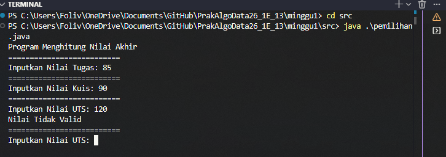
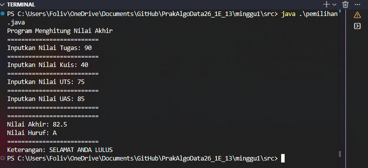
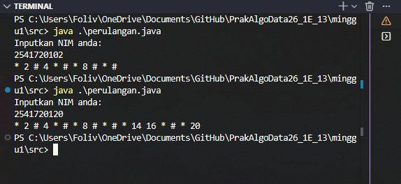
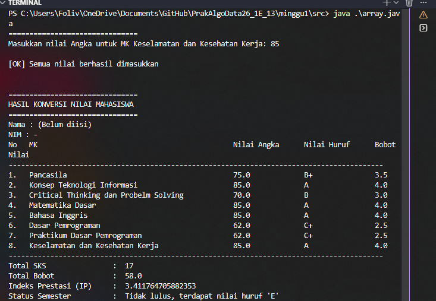
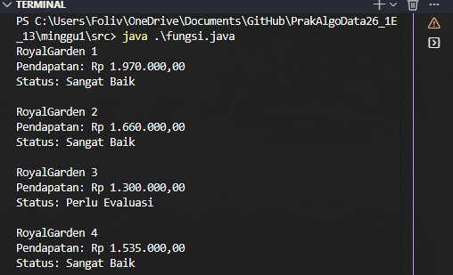
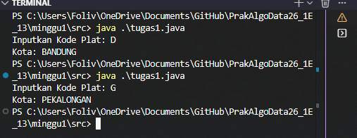
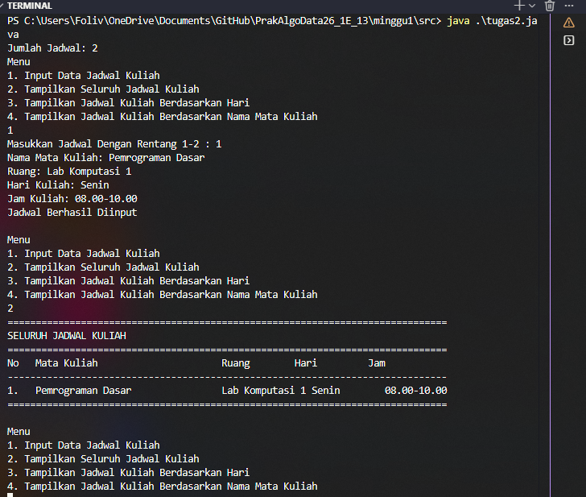
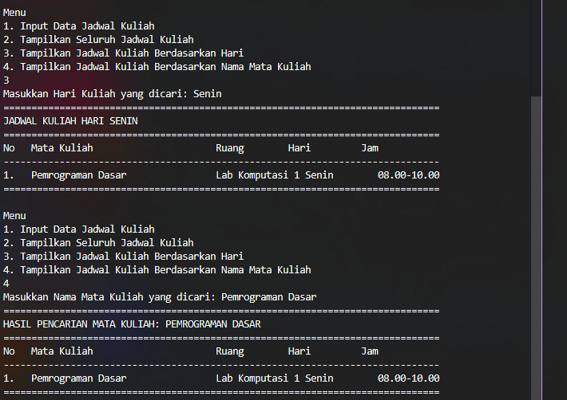

# Laporan Praktikum Dasar Pemrograman Jobsheet 1

<h4>Nama : Mohammad Daanii Althaaf Reivan Fadhlillah<h4>
<h4>NIM : 254107020123<h4>
<h4>Kelas : TI-1E<h4>

## 2.2.1 Praktikum Pemilihan

### Pertanyaan Percobaan 1
1. Hasil Running Program: 

## 2.3.1 Praktikum Perulangan
1. Hasil Running Program: 

## 2.4.1 Praktikum Array
1. Hasil Running Program:

## 2.5.1 Praktikum Fungsi
1. Hasil Running Program:

## 3. Tugas
1. Hasil Running Program:

2. Hasil Running Program:

  
### Pertanyaan Percobaan 1