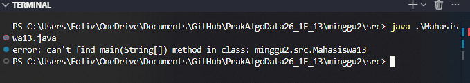
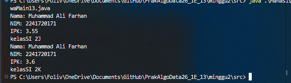

# Laporan Praktikum Dasar Pemrograman Jobsheet 2

<h4>Nama : Mohammad Daanii Althaaf Reivan Fadhlillah<h4>
<h4>NIM : 254107020123<h4>
<h4>Kelas : TI-1E<h4>

## 2.1.2 Verifikasi Hasil Percobaan
```
package minggu2.src;

public class Mahasiswa13 {
  static String nim, nama, kelas;
  static double ipk;
  
  static void tampilkanInformasi(){
    System.out.println("Nama: " + nama);
    System.out.println("NIM: " + nim);
    System.out.println("IPK: " + ipk);
    System.out.println("kelas" + kelas);
  }

  static void ubahKelas(String kelasBaru){
    kelas = kelasBaru;
  }
  static void updateIpk(double ipkBaru){  
    if(ipk>=0 && ipk<= 4.0) ipk = ipkBaru;
  }

  static String nilaiKinerja(double ipk){
    if(ipk>=3.5){
      return "Kinerja sangat baik";
    }else if(ipk>=3.0){
      return "Kinerja baik";
    }else if(ipk>=2.0){
      return "Kinerja Cukuo";
    }else{
      return "Kinerja Kurang";
    }
  }
}

```


## 2.1.3 Pertanyaan

1. - Class atau object memilki inisiasi yang diawali nama, dengan parameter sebagai opsi serta dibuka dan ditutup dengan kurung kurawal.
    - Class atau object harus diinstansiasi sebagai objek baru agar bisa digunakan.

2. Ada 4 atribut, yaitu NIM, nama, kelas, dan ipk.

3. ada 4 method dalam class tersebut, yaitu tampilkanInformasi, ubahKelas, updateIpk, dan nilaiKinerja.
4. ``` static void updateIpk(double ipkBaru){ if(ipk>=0 && ipk<= 4.0) {ipk = ipkBaru;} else{System.out.println("IPK tidak valid. Harus antara 0.0 dan 4.0");}} ```
5. nilaiKinerja menggunakan ipk sebagai treshold. jika ipk lebih dari sama dengan 3.5, maka kinerja dikatakan sangat baik. Sementara jika ipk dalam rentang 3.0-3.49, itu dikatakan kinerja baik, ipk dalam rentang 2.0-2.99 akan mengembalikan value kinerja cukup, dan dibawah 2 akan menjadi kinerja kurang. Nilai yang dikembalikan merupakan string yang sesuai dengan branching.
6. 

## 2.2.2 Verifikasi Hasil Percobaan
```
package minggu2.src;

public class MahasiswaMain13 {
  public static void main(String[] args) {
    Mahasiswa13 mhs1 = new Mahasiswa13();
    mhs1.nama = "Muhammad Ali Farhan";
    mhs1.nim = "2241720171";
    mhs1.kelas = "SI 2J";
    mhs1.ipk = 3.55;

    mhs1.tampilkanInformasi();
    mhs1.ubahKelas("SI 2K");
    mhs1.updateIpk(3.6);
    mhs1.tampilkanInformasi();
  }
}
```
 

## 2.2.3 Pertanyaan
1. ```Mahasiswa13 mhs1 = new Mahasiswa13();```
2. Menggunakan titik setelah variable object dan diikuti nama method.
3. Value dari atribut kelas diubah lewat fungsi ubahKelas, dan value dari ipk yang diubah lewat fungsi updateIpk.