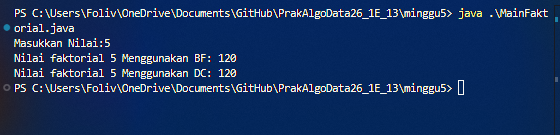
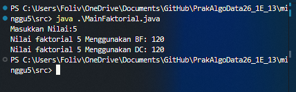
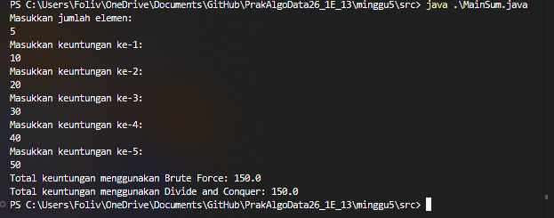
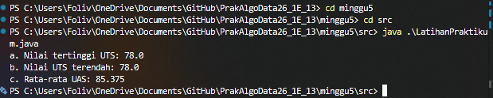

# Laporan Praktikum Algoritma dan Struktur Data Jobsheet 5

<h4>Nama : Mohammad Daanii Althaaf Reivan Fadhlillah<h4>
<h4>NIM : 254107020123<h4>
<h4>Kelas : TI-1E<h4>

## 5.2.2 Verifikasi Hasil Percobaan


## 5.2.3 Pertanyaan
1. Pada bagian `if`, itu merujuk pada bagian **base case** yang dimana jika `n` sudah sama dengan 1, maka akan kembali ke pemanggil dengan value 1. Sementara `else` akan memanggil fungsinya sendiri secara rekursif sampai kondisi `if` terpenuhi (n==1) dan mengalikan semua bilangan yang telah dikembalikan secara berurutan.
2. Ya, perulangan `for` bisa diubah menjadi `while`:
    ```java
    int faktorialBF(int n){
      int fakto=1;
      int i = 1; 
      while (i <= n ) {
        fakto = fakto * i;
        i++;
      }
      return fakto;
    }
    ```
3. `fakto *= i;` menggunakan angka iterasi looping untuk operasi perkalian secara langsung (iteratif). Sementara `int fakto = n * faktorialDC(n-1);` menggunakan rekursif untuk memecah masalah menjadi sub-masalah hingga mencapai base case, lalu mengalikan hasilnya saat kembali.
4. `faktorialBF()` menggunakan loop (perulangan) untuk menyelesaikan faktorial secara sekuensial, sementara `faktorialDC()` menggunakan rekursif (memanggil diri sendiri) untuk memecah dan menyelesaikan faktorial dengan konsep Divide and Conquer.

## 5.3.2 Verifikasi Hasil Percobaan


## 5.3.3 Pertanyaan 
1. `pangkatBF()` menggunakan `for loop` (iteratif) untuk melakukan perkalian basis sebanyak eksponen secara berulang. Sementara `pangkatDC()` menggunakan `rekursif` (Divide and Conquer) dengan membagi pangkat menjadi dua sub-masalah (n/2) untuk mengoptimalkan jumlah perkalian.
2. Ya, tahap **combine** ada di bagian `return` saat hasil rekursif dari sisi kiri dan kanan dikalikan:
    ```java
    if(n%2==1){
      return (pangkatDC(a, n/2) * pangkatDC(a, n/2) * a);
    }else{
      return (pangkatDC(a, n/2) * pangkatDC(a, n/2));
    }
    ```
3. Tetap relevan jika ingin method tersebut bisa menerima input dari luar secara dinamis. Namun, jika sudah ada atribut `nilai` dan `pangkat` di class, method tersebut bisa dibuat tanpa parameter agar lebih praktis. 
    Contoh method tanpa parameter:
    ```java
    int pangkatBF(){
      int hasil = 1;
      for(int i=0; i<pangkat; i++){
        hasil = hasil * nilai;
      }
      return hasil;
    }
    ```
4. `pangkatBF()` bekerja dengan cara mengalikan basis secara berulang sebanyak eksponen menggunakan loop. `pangkatDC()` bekerja dengan membagi masalah (pangkat) menjadi dua bagian yang lebih kecil secara rekursif, menyelesaikannya, lalu menggabungkannya kembali (combine).

## 5.4.2 Verifikasi Hasil Percobaan


## 5.4.3 Pertanyaan
1. Variable `mid` dibutuhkan sebagai titik tengah untuk membagi (divide) array menjadi dua bagian (kiri dan kanan) dalam proses rekursif Divide and Conquer.
2. Statement tersebut dilakukan untuk memecah masalah (menghitung total array) menjadi dua sub-masalah yang lebih kecil (total bagian kiri dan total bagian kanan) secara rekursif hingga mencapai base case.
3. Penjumlahan `lsum` dan `rsum` diperlukan sebagai tahap **combine**, yaitu menggabungkan hasil perhitungan dari sub-masalah yang telah dipecah sebelumnya menjadi satu hasil total yang utuh.
4. Base case dari `totalDC()` adalah saat `l == r`, yang menandakan array sudah tinggal satu elemen saja, sehingga langsung mengembalikan nilai elemen tersebut (`return arr[l];`).
5. `totalDC()` bekerja dengan membagi array menjadi dua bagian terus-menerus (Divide) sampai tersisa satu elemen (Conquer), lalu hasil dari tiap elemen tersebut dijumlahkan kembali (Combine) hingga didapatkan total keseluruhan.

## 4.5 Latihan Praktikum

- a. Nilai tertinggi UTS dicari menggunakan Divide and Conquer dengan membandingkan nilai maksimal di bagian kiri dan kanan array.
- b. Nilai terendah UTS dicari menggunakan Divide and Conquer dengan membandingkan nilai minimal di bagian kiri dan kanan array secara rekursif.
- c. Rata-rata UAS dihitung menggunakan Brute Force dengan cara menjumlahkan semua elemen array secara iteratif lalu membaginya dengan jumlah elemen.
